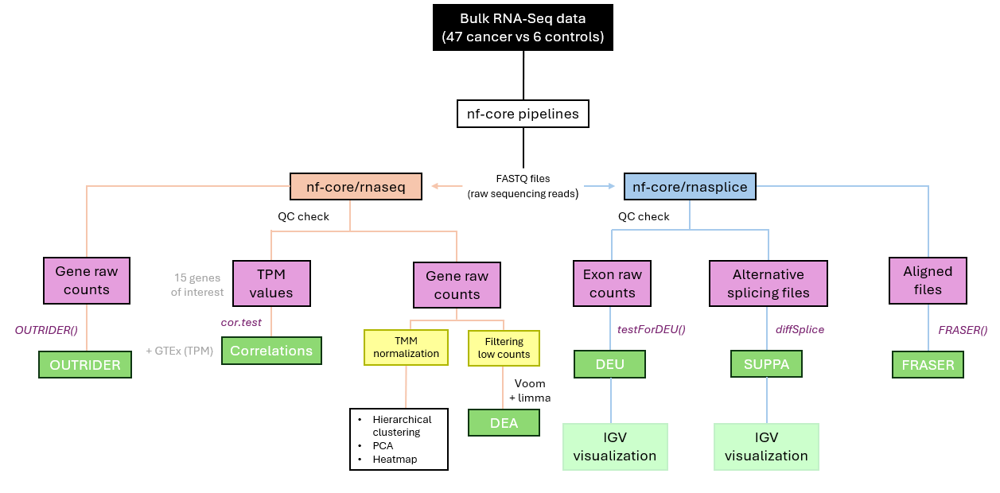

# RNA sequencing role in the genetic diagnosis of hereditary breast and ovarian cancer.
This repository contains the code used to carry out the final master project titled: **RNA sequencing role in the genetic diagnosis of hereditary breast and ovarian cancer**

Here is the workflow followed in the project:

## Quality control (QC)
Comparison of TPM values between our study and those obtained from GTEx. The code is located in the R folder under the name .

## RNA-seq
The first step was to run the **RNA-seq pipeline** using Nextflow. To achieve this: 

* We created a nextflow.config file, located in the BASH folder under the name . This file contains the Nextflow requirements for job distribution and resource allocation.
  
* We created a shell script with the necessary specifications to run the nf-core pipeline, located in the BASH folder under the name .

The second step was to examine the outputs/results obtained by the pipeline. To achieve this: 

* First, we performed a differential expression analysis (DEA). The code is located in the R folder under the name .
  
* Second, we performed an analysis to find aberrantly expressed genes in RNA-seq samples. The code is located in the R folder under the name .

## RNA-splice
The first step was to run the **RNA-splice pipeline** using Nextflow. To achieve this: 

* We created a nextflow.config file, located in the BASH folder under the name . This file contains the Nextflow requirements for job distribution and resource allocation.
  
* We created a shell script with the necessary specifications to run the nf-core pipeline, located in the BASH folder under the name .

The second step was to examine the outputs/results obtained by the pipeline. To achieve this: 

* First, we performed a differential exon usage analysis (DEU). The code is located in the R folder under the name .
  
* Second, we processed the .dpsi objects obtained from the SUPPA analysis, which was automatically performed by the pipeline. The code is located in the R folder under the name .

* Third, we performed an analysis for the detection of aberrant gene expression events in RNA-seq data. The code is located in the R folder under the name .

